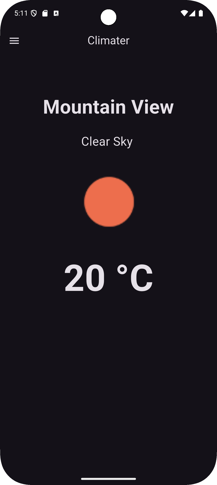
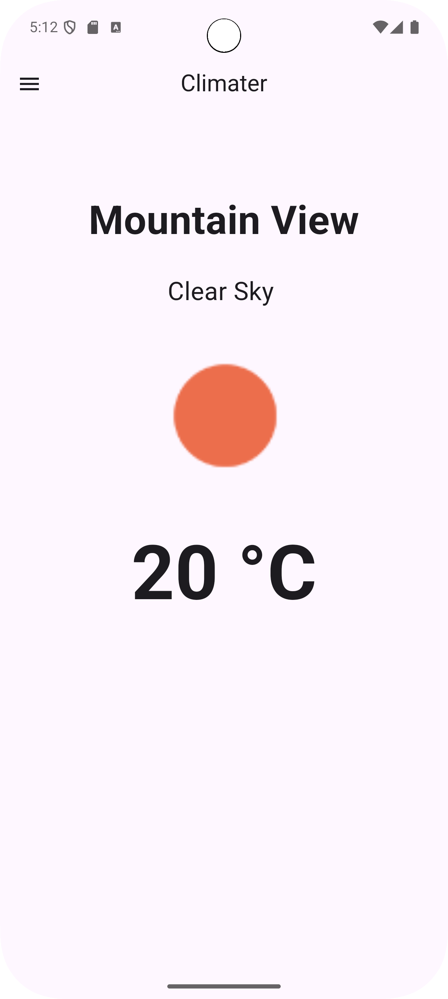
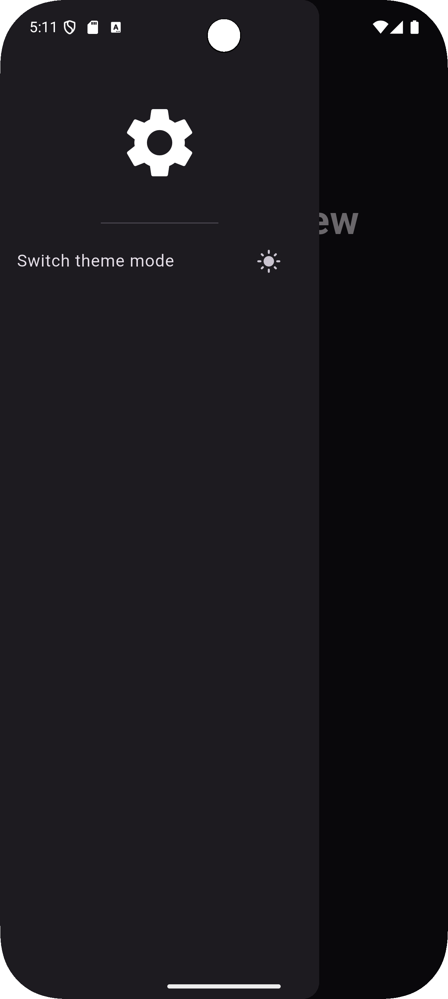
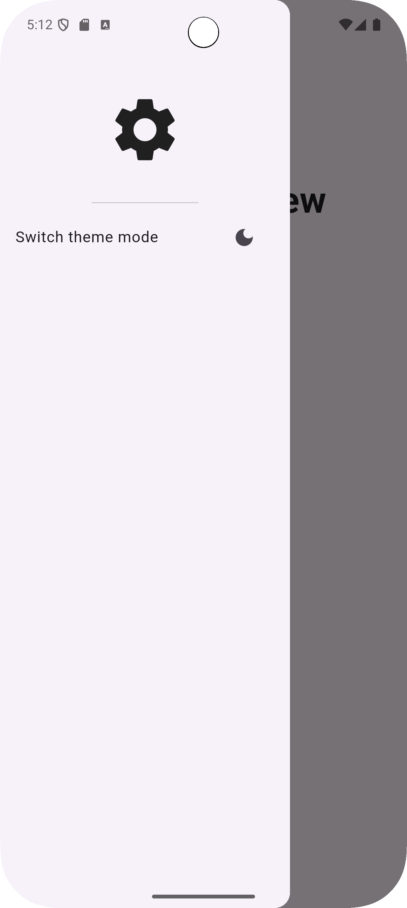

# 🌦️ Climater

**Climater** is a modern and intuitive weather app built with Flutter. It provides current weather information based on
your location, using data from the OpenWeatherMap API. The app features a clean interface, dark/light theme support, unit toggling, data caching, internationalization, and more.

## 🚀 Features

- 📍 Fetches weather based on your **current location**
- 🌤 Displays real-time weather data using the **OpenWeatherMap API**
- 💾 **Caches weather data** locally using **SQLite**
- 🕓 Displays **last updated time** in the app bar
- 🌡 Toggle between **Celsius and Fahrenheit**, with preferences saved via `shared_preferences`
- 🌍 **Internationalization**: Supports **English** and **Portuguese**
- 🌙 Light and dark theme modes, persisted across sessions
- 🎞 Smooth **temperature animation** with `Tween`
- ⚙️ Uses `provider` for state management
- 🔐 Secures your API key with `.env` and `flutter_dotenv`

## 🛠 Built With

- **Flutter** – UI toolkit for beautiful native apps
- **OpenWeatherMap API** – Weather data provider
- **SQLite (sqflite)** – Local database caching
- **Provider** – App-wide state management
- **Geolocator & Geocoding** – Get device location and convert it to an address
- **Shared Preferences** – Save theme and unit preferences
- **Flutter Intl + flutter_localizations** – Language support
- **Flutter Dotenv** – Environment variable management

## 📦 Dependencies

These are the main dependencies used in this project (from [`pubspec.yaml`](pubspec.yaml)):

```yaml
dependencies:
  flutter:
    sdk: flutter
  cupertino_icons: ^1.0.8
  provider: ^6.1.5
  http: ^1.4.0
  flutter_dotenv: ^5.2.1
  geocoding: ^4.0.0
  geocode: ^1.0.3
  geolocator: ^14.0.1
  shared_preferences: ^2.5.3
  font_awesome_flutter: ^10.8.0
  location: ^8.0.0
  sqflite: ^2.4.2
  path: ^1.9.1
  intl: ^0.20.2
  flutter_localizations:
    sdk: flutter
  build_runner: ^2.4.15
  flutter_gen: ^5.10.0
````

> ℹ️ Run `flutter pub get` after modifying dependencies. You can check for updates using `flutter pub outdated`.

## 🗝️ API Key Setup

1. Create a `.env` file in the root of your project:

   ```env
   API_KEY=your_api_key_here
   ```

2. Load the `.env` in `main.dart`:

   ```dart
   import 'package:flutter_dotenv/flutter_dotenv.dart';

   void main() async {
     await dotenv.load();
     runApp(const MyApp());
   }
   ```

3. Access the key like this:

   ```dart
   final apiKey = dotenv.env['API_KEY'];
   ```

4. Add `.env` to your `.gitignore` to avoid committing secrets:

   ```gitignore
   .env
   ```

## 🖼 Screenshots






## 🔧 Getting Started

```bash
git clone https://github.com/Gsdagustavo/climater.git
cd climater
flutter pub get
```

* Set up the `.env` file as shown above.
* Make sure location permissions are set up in Android and iOS.
* Then run the app:

  ```bash
  flutter run
  ```

## 🤝 Contributing

Contributions are welcome! Feel free to fork this repo and open a pull request with improvements or new features.

## 📄 License

This project is licensed under the [MIT License](LICENSE).

---

Made with ❤️ using Flutter.